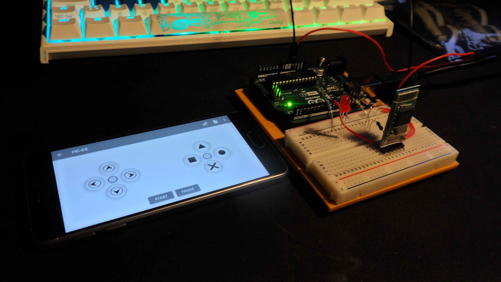

Per the description this project simply allows me to explore different usecases for the HC-05 bluetooth module.
My Samsung A3 (2016) is being used as the controller via playstore app "Arduino Bluetooth Control". The main goal is to learn and explore. Proper uses/products aren't the focus here.

# Turn off and on LED

The A3 sends either the character F or B so that the LED outputs HIGH or LOW

ref: [relevant code](BluetoothLed.ino)
